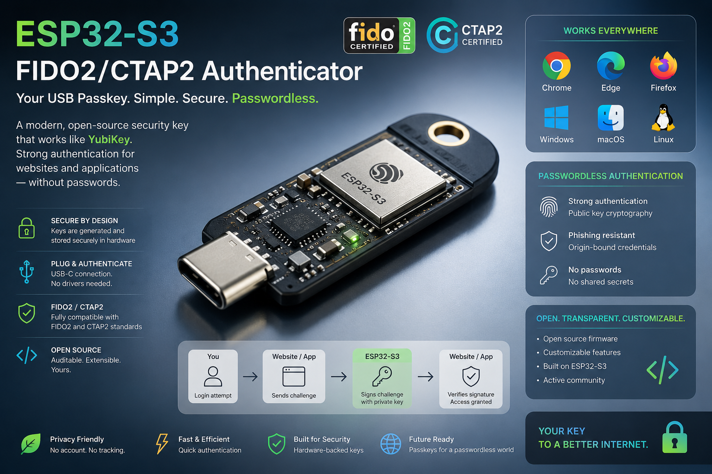

# Pico FIDO — ESP32-S3



FIDO2/CTAP2 аутентификатор на базе ESP32-S3. Работает как USB Passkey для аутентификации в браузерах и приложениях.

## Возможности

### Основные
- CTAP 2.1 / CTAP 1
- WebAuthn / U2F
- Обнаруживаемые учётные данные (resident keys)
- Верификация пользователя через PIN (мин. 1 символ)
- Принудительное подтверждение пользователя физической кнопкой
- makeCredUvNotRqd (регистрация без PIN при включённой опции)

### Криптография
- ECDSA и EDDSA аутентификация
- SECP256R1, SECP384R1, SECP521R1, SECP256K1, Ed25519
- HMAC-Secret, CredProtect, minPinLength расширения

### OATH/TOTP
- OATH (YKOATH протокол)
- TOTP / HOTP
- Совместимость с Yubico Authenticator и YKMAN
- Эмулируемый интерфейс клавиатуры (OTP вводится напрямую)

### Безопасность
- Secure Boot и Secure Lock
- Одноразовое программирование (OTP) для мастер-ключа
- BIP39 Backup с 24 словами

### Кастомизация
- Кастомный VID/PID и USB-имя устройства
- Настройка LED (яркость, драйвер, порядок цветов, GPIO)

### Интерфейс
- Интерфейс восстановления
- Pico Key TUI (TUI утилита)

## Прошивка

1. Установите [ESP-IDF v5.5](https://docs.espressif.com/projects/esp-idf/en/v5.5/esp32s3/get-started/index.html)
2. Подключите ESP32-S3 в режим загрузки (BOOT + USB)
3. Прошейте:

```sh
git clone https://github.com/Garrysoon/pico-fido.git
cd pico-fido
git submodule update --init --recursive
idf.py set-target esp32s3
idf.py build
idf.py -p COM3 flash
```

4. Перезагрузите устройство

## Vendor команды

| Команда | ID | Описание |
|---------|-----|----------|
| Backup | `0x01` | Экспорт/импорт зашифрованного ключа |
| MSE | `0x02` | Key Agreement |
| Unlock | `0x03` | Разблокировка |
| EA | `0x04` | Enterprise Attestation |
| Admin PIN | `0x08` | Установка Admin PIN |
| BIP39 | `0x09` | Генерация/восстановление мнемоники |

### LED Vendor команды

| Команда | ID | Описание | Значения |
|---------|-----|----------|----------|
| LED Brightness | `0x09d1e2f3a4b5c6` | Яркость | 0-15 |
| LED Driver | `0x0a1b2c3d4e5f60` | Драйвер | 1=Pico, 2=Pimoroni, 3=WS2812, 5=Neopixel |
| LED Order | `0x0b2c3d4e5f6071` | Порядок цветов | 0=RGB, 2=GRB |
| LED GPIO | `0x0c3d4e5f607182` | GPIO пин | 0-255 |

## Pico Key TUI

TUI утилита для управления устройством:

```sh
cd pico-key-tui
pip install -r requirements.txt
python -m pico_key_tui
```

### Возможности TUI:
- Установка/изменение PIN
- Управление OATH аккаунтами
- Backup/восстановление (24 слова)
- Настройка LED
- Смена VID/PID и имени устройства

## Backup с 24 словами

**ВАЖНО:** Если вы потеряете ключ без backup, все аккаунты будут потеряны!

### Создание backup:
1. Запустите TUI
2. Выберите "Backup" → "Создать backup"
3. Нажмите кнопку на ключе
4. Запишите 24 слова на бумаге
5. Храните в безопасном месте

### Восстановление:
1. Прошейте новый ESP32-S3
2. Запустите TUI
3. Выберите "Backup" → "Восстановить из backup"
4. Введите 24 слова
5. Нажмите кнопку

## Кастомизация USB

### Имя устройства:
Измените в `pico-keys-sdk/src/usb/usb_descriptors.c`:
```c
"Yubikey 5A",                     // 2: Product
```

### VID/PID:
Измените в `sdkconfig`:
```
CONFIG_USB_VID=0x1050
CONFIG_USB_PID=0x0407
```

### Производитель:
Измените в `pico-keys-sdk/src/usb/usb_descriptors.c`:
```c
"Garry Garrysoon",                   // 1: Manufacturer
```

## Инструкция пользователя

Подробная инструкция на русском языке: [docs/USER_MANUAL_RU.md](docs/USER_MANUAL_RU.md)

## Лицензия

GNU Affero General Public License v3 (AGPLv3).

## Благодарности

- [pico-fido](https://github.com/polhenarejos/pico-fido) — исходный проект
- [ESP-IDF](https://github.com/espressif/esp-idf) — фреймворк для ESP32
- [TinyUSB](https://github.com/hathach/tinyusb) — USB стек
- [mbedTLS](https://github.com/Mbed-TLS/mbedtls) — криптографическая библиотека
